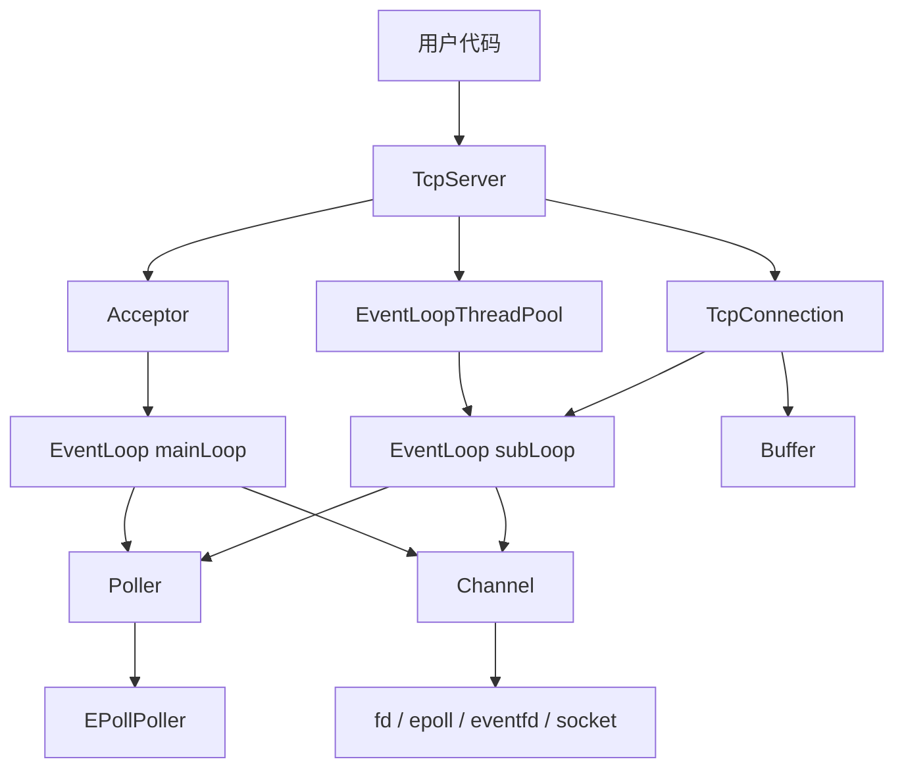
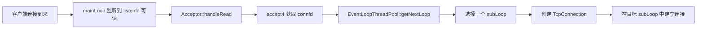
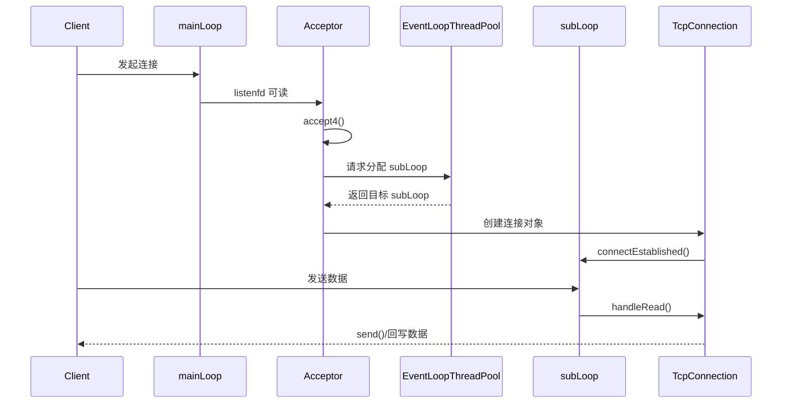

# Frank_muduo

一个基于 C++11 实现的轻量级 Linux TCP 网络库，整体设计参考 muduo，核心模型为：

`Reactor + one loop per thread + 主从 Reactor + 线程池`

它不是对 muduo 的完整复刻，而是一个更聚焦于 TCP 服务端主链路的学习型实现。项目已经打通了从监听端口、接收连接、事件分发、消息收发到连接销毁的完整路径，适合用来学习 Reactor 网络编程，也适合作为个人网络框架继续扩展。

---

## 项目亮点

- 基于 `epoll` 的 I/O 多路复用模型
- 主从 Reactor 结构：`mainLoop` 负责接入，`subLoop` 负责 I/O
- `one loop per thread`，每个 I/O 线程独占一个 `EventLoop`
- 基于 `eventfd` 的跨线程唤醒机制
- `Channel` 封装 fd 与事件回调的绑定关系
- `TcpServer` / `TcpConnection` 封装服务端和连接生命周期
- `Buffer` 提供应用层输入输出缓冲区
- 使用 `shared_ptr + weak_ptr + tie()` 处理回调期间的生命周期安全

---

## 项目状态

当前仓库已经具备一个可运行的 TCP 服务端核心框架，适合：

- 学习 Reactor 网络库的整体结构
- 阅读从 `TcpServer` 到 `TcpConnection` 的主调用链
- 理解 `epoll`、非阻塞 socket、线程池、跨线程唤醒如何配合
- 在现有基础上继续补充定时器、客户端、日志、连接管理等能力

当前实现已经覆盖：

- `EventLoop`
- `Poller / EPollPoller`
- `Channel`
- `Acceptor`
- `TcpServer`
- `TcpConnection`
- `EventLoopThread / EventLoopThreadPool`
- `Buffer`
- `Socket / InetAddress`
- `Logger / Timestamp / CurrentThread`

当前仍属于“学习型框架”而不是“完整工业级网络库”，这点需要明确。

---

## 快速理解

一句话理解这个项目：

主线程负责接收新连接，工作线程负责处理连接上的 I/O，`EventLoop` 负责驱动事件循环，`Poller` 负责与 `epoll` 交互，`Channel` 负责事件分发，`TcpConnection` 负责单个连接的收发和生命周期。

### 整体分层图

```text
+------------------------------------------------------------------+
|                          用户业务层                               |
|                EchoServer / 自定义业务回调逻辑                     |
+------------------------------------------------------------------+
                              |
                              v
+------------------------------------------------------------------+
|                         TCP 抽象层                                |
|                TcpServer / TcpConnection / Buffer                |
+------------------------------------------------------------------+
                              |
                              v
+------------------------------------------------------------------+
|                     事件驱动与线程调度层                          |
|        EventLoop / Acceptor / EventLoopThreadPool                |
+------------------------------------------------------------------+
                              |
                              v
+------------------------------------------------------------------+
|                     事件封装与 I/O 复用层                         |
|                 Channel / Poller / EPollPoller                   |
+------------------------------------------------------------------+
                              |
                              v
+------------------------------------------------------------------+
|                      Linux 系统调用层                             |
|      socket / bind / listen / accept4 / epoll / eventfd / readv |
+------------------------------------------------------------------+
```

### 模块关系图



如果当前平台不支持 Mermaid，可以直接阅读上面的纯文本分层图。

---

## 目录

- [项目亮点](#项目亮点)
- [项目状态](#项目状态)
- [快速开始](#快速开始)
- [示例程序](#示例程序)
- [整体架构](#整体架构)
- [线程模型](#线程模型)
- [关键调用链](#关键调用链)
- [核心模块](#核心模块)
- [目录结构](#目录结构)
- [适合谁阅读](#适合谁阅读)
- [当前限制](#当前限制)
- [后续可扩展方向](#后续可扩展方向)

---

## 快速开始

### 环境要求

- Linux 或 WSL2
- `g++`
- `cmake >= 3.10`
- `make`
- `pthread`

建议使用 Ubuntu 20.04 及以上版本。

### 方式一：使用 CMake 构建共享库

根目录 `CMakeLists.txt` 当前会生成共享库：

```text
lib/libFrank_muduo.so
```

构建命令：

```bash
mkdir -p build
cd build
cmake ..
make
```

### 方式二：使用 `autobuild.sh`

仓库根目录提供了 `autobuild.sh`。脚本会：

1. 清空并重建 `build/`
2. 执行 `cmake ..` 和 `make`
3. 把头文件复制到 `/usr/include/mymuduo/`
4. 把动态库复制到 `/usr/lib/`
5. 执行 `ldconfig`

执行方式：

```bash
bash autobuild.sh
```

注意：

- 这个脚本包含 `sudo`
- 它会向系统目录安装头文件和动态库
- 如果你只是本地阅读和调试源码，可以只使用 CMake 构建，不一定需要安装到系统目录

---

## 示例程序

仓库中提供了一个简单的 echo server 示例：

- `example/testserver.cc`

这个示例的使用方式非常接近真实业务代码：

```cpp
EventLoop loop;
InetAddress addr(8000);
TcpServer server(&loop, addr, "EchoServer");

server.setConnectionCallback(...);
server.setMessageCallback(...);
server.setThreadNum(3);

server.start();
loop.loop();
```

示例完成了这些事情：

- 创建主事件循环
- 创建服务端对象
- 注册连接回调
- 注册消息回调
- 设置 I/O 线程数量
- 启动服务器并进入事件循环

消息处理逻辑是一个最简单的 echo 流程：

- 从 `Buffer` 取出收到的数据
- 调用 `conn->send(msg)` 把数据原样回写

### 关于示例编译的说明

当前 `example/testserver.cc` 使用的是：

```cpp
#include <mymuduo/EventLoop.h>
```

这说明它默认面向“安装到系统头文件目录后的使用方式”。

因此：

- 如果你已经执行过 `autobuild.sh`，这种包含方式是合理的
- 如果你只是本地直接编译仓库源码，可能需要调整包含路径或编译参数

---

## 整体架构

从职责上看，项目可以分为四层：

1. 用户业务层
2. TCP 抽象层
3. 事件驱动与线程调度层
4. I/O 复用与系统调用层

### 架构图

```text
用户业务代码
  |
  v
TcpServer / TcpConnection
  |
  v
EventLoop / EventLoopThreadPool / Acceptor
  |
  v
Channel / Poller / EPollPoller
  |
  v
socket / eventfd / epoll / readv / write
```

### 核心设计思想

这个项目的设计核心可以概括为 5 点：

1. `Reactor`
2. `one loop per thread`
3. 主从 Reactor
4. 事件驱动与回调分发
5. 跨线程任务投递与唤醒

具体来说：

- `Poller` 负责监听哪些 fd 活跃
- `Channel` 负责把活跃事件分发给对应回调
- `EventLoop` 负责驱动事件循环与任务调度
- `TcpServer` 负责对外提供服务端入口
- `TcpConnection` 负责单个连接的收发与生命周期管理

---

## 线程模型

项目采用主从 Reactor 线程结构：

- 主线程中的 `mainLoop` 负责监听和接收新连接
- `EventLoopThreadPool` 负责管理多个工作线程
- 每个工作线程运行一个 `subLoop`
- 新连接建立后，会被分配到某个 `subLoop`
- 该连接后续的读写事件通常都在所属 `subLoop` 中处理

### 线程职责图

```text
主线程
  |
  +-- EventLoop(mainLoop)
        |
        +-- Acceptor
              |
              +-- 监听 listenfd
              +-- accept 新连接
              +-- 选择一个 subLoop

工作线程 1
  |
  +-- EventLoop(subLoop1)
        |
        +-- 管理一批 TcpConnection
        +-- 处理读事件 / 写事件 / 关闭事件

工作线程 2
  |
  +-- EventLoop(subLoop2)
        |
        +-- 管理另一批 TcpConnection
        +-- 处理读事件 / 写事件 / 关闭事件
```

### 新连接分发图



---

## 关键调用链

这一部分是理解整个项目最重要的主线。

### 1. 服务启动

```text
用户代码
  -> 创建 EventLoop
  -> 创建 TcpServer
  -> 注册回调
  -> TcpServer::start()
  -> EventLoop::loop()
```

内部流程：

```text
TcpServer::start()
  -> EventLoopThreadPool::start()
  -> 启动多个 EventLoopThread
  -> mainLoop 中执行 Acceptor::listen()
  -> listenfd 注册到 Poller
  -> EventLoop 进入 loop()
```

### 2. 新连接建立

```text
listenfd 可读
  -> Acceptor::handleRead()
  -> accept4() 获取 connfd
  -> TcpServer::newConnection()
  -> EventLoopThreadPool::getNextLoop()
  -> 创建 TcpConnection
  -> 在目标 subLoop 中执行 connectEstablished()
```

### 3. 消息到达

```text
connfd 可读
  -> epoll_wait 返回
  -> EventLoop 获得活跃 Channel
  -> Channel::handleEvent()
  -> TcpConnection::handleRead()
  -> Buffer::readFd()
  -> 调用 messageCallback
```

### 4. 消息发送

```text
用户调用 send()
  -> 如果在所属 loop 线程，直接 sendInLoop()
  -> 否则 queueInLoop()
  -> 先尝试直接写 socket
  -> 未写完的数据进入 outputBuffer_
  -> 注册写事件
  -> 可写时进入 handleWrite()
  -> 数据写完后取消写事件
```

### 总时序图



---

## 核心模块

### EventLoop

相关文件：

- `include/EventLoop.h`
- `src/EventLoop.cc`

职责：

- 驱动事件循环
- 调用 `Poller` 等待 I/O 事件
- 执行活跃 `Channel` 的回调
- 执行跨线程投递任务
- 通过 `eventfd` 唤醒阻塞中的 loop

### Poller / EPollPoller

相关文件：

- `include/Poller.h`
- `include/EPollPoller.h`
- `src/Poller.cc`
- `src/EPollPoller.cc`

职责：

- 抽象 I/O 复用器接口
- 管理 `fd -> Channel*` 映射
- 调用 `epoll_wait`
- 回填活跃事件
- 处理 `epoll_ctl(add/mod/del)`

说明：

- 当前主实现是 `epoll`
- 当前代码没有启用 `EPOLLET`

### Channel

相关文件：

- `include/Channel.h`
- `src/Channel.cc`

职责：

- 绑定 fd 和其关注事件
- 保存读、写、关闭、错误回调
- 在事件发生时把回调分发给上层对象

补充说明：

- `Channel` 是事件分发器，不是业务对象
- `tie()` 用于保护回调执行期间的对象生命周期

### Acceptor

相关文件：

- `include/Acceptor.h`
- `src/Acceptor.cc`

职责：

- 创建监听 socket
- 执行 `bind + listen`
- 在 `listenfd` 可读时执行 `accept4`
- 把新连接交给 `TcpServer`

### TcpServer

相关文件：

- `include/TcpServer.h`
- `src/TcpServer.cc`

职责：

- 对外提供服务端使用入口
- 管理 `Acceptor`
- 管理 `EventLoopThreadPool`
- 保存活动连接
- 给连接绑定各类用户回调

### TcpConnection

相关文件：

- `include/TcpConnection.h`
- `src/TcpConnection.cc`

职责：

- 抽象单个 TCP 连接
- 管理输入输出缓冲区
- 处理读写事件
- 处理连接关闭和销毁
- 提供 `send()`、`shutdown()` 等接口

### Buffer

相关文件：

- `include/Buffer.h`
- `src/Buffer.cc`

职责：

- 管理应用层输入输出数据
- 配合 `readv` 执行高效读取
- 处理一次读不完、写不完的情况

---

## 目录结构

```text
.
├── CMakeLists.txt
├── autobuild.sh
├── README.md
├── include/
│   ├── Acceptor.h
│   ├── Buffer.h
│   ├── Callbacks.h
│   ├── Channel.h
│   ├── CurrentThread.h
│   ├── EPollPoller.h
│   ├── EventLoop.h
│   ├── EventLoopThread.h
│   ├── EventLoopThreadPool.h
│   ├── InetAddress.h
│   ├── Logger.h
│   ├── Poller.h
│   ├── Socket.h
│   ├── TcpConnection.h
│   ├── TcpServer.h
│   ├── Thread.h
│   ├── Timestamp.h
│   └── nocopyable.h
├── src/
│   ├── Acceptor.cc
│   ├── Buffer.cc
│   ├── Channel.cc
│   ├── CurrentThread.cc
│   ├── DefaultPoller.cc
│   ├── EPollPoller.cc
│   ├── EventLoop.cc
│   ├── EventLoopThread.cc
│   ├── EventLoopThreadPool.cc
│   ├── InetAddress.cc
│   ├── Logger.cc
│   ├── Poller.cc
│   ├── Socket.cc
│   ├── TcpConnection.cc
│   ├── TcpServer.cc
│   ├── Thread.cc
│   └── Timestamp.cc
└── example/
    ├── Makefile
    └── testserver.cc
```

---

## 适合谁阅读

这个仓库尤其适合下面几类读者：

- 正在学习 C++ 网络编程的人
- 想理解 muduo 设计思想的人
- 想自己实现一个 Reactor 框架骨架的人
- 想把 `epoll + 线程池 + 回调分发` 串成完整调用链的人

如果你是第一次阅读这类项目，推荐按下面顺序看源码：

1. `EventLoop`
2. `Channel`
3. `Poller / EPollPoller`
4. `Acceptor`
5. `TcpConnection`
6. `TcpServer`
7. `EventLoopThread / EventLoopThreadPool`
8. `Buffer`

---

## 当前限制

当前需要明确的边界：

- `poll` 版本的 `Poller` 还没有真正实现，当前主实现是 `epoll`
- 没有定时器模块
- 没有 `TcpClient`
- 没有异步日志模块
- 根目录 `CMakeLists.txt` 当前只构建库，不自动构建 `example/`
- 示例头文件路径更偏向“安装后使用”，本地直编可能需要调整

因此，它更适合作为：

- 学习项目
- 架构理解项目
- 二次开发基础项目

而不是直接作为完整成熟的生产级网络库。

---

## 后续可扩展方向

如果要继续把这个项目做强，比较自然的扩展路径包括：

- 增加定时器与超时任务调度
- 增加 `TcpClient`
- 增加更完整的日志系统
- 增加连接空闲检测
- 增加更完善的测试和 benchmark
- 优化构建系统，让 `example/` 直接纳入 CMake
- 增加更标准的安装、导出头文件和包配置支持

---

## 总结

`Frank_muduo` 的价值不在于功能数量，而在于它已经把一个 C++ Reactor 网络库最核心的骨架搭起来了：

- 有事件循环
- 有 `epoll`
- 有主从 Reactor
- 有连接抽象
- 有线程池
- 有缓冲区
- 有跨线程唤醒

如果你的目标是看懂网络库主链路、练习源码阅读，或者在此基础上继续做自己的网络框架，这个仓库已经是一个不错的起点。
